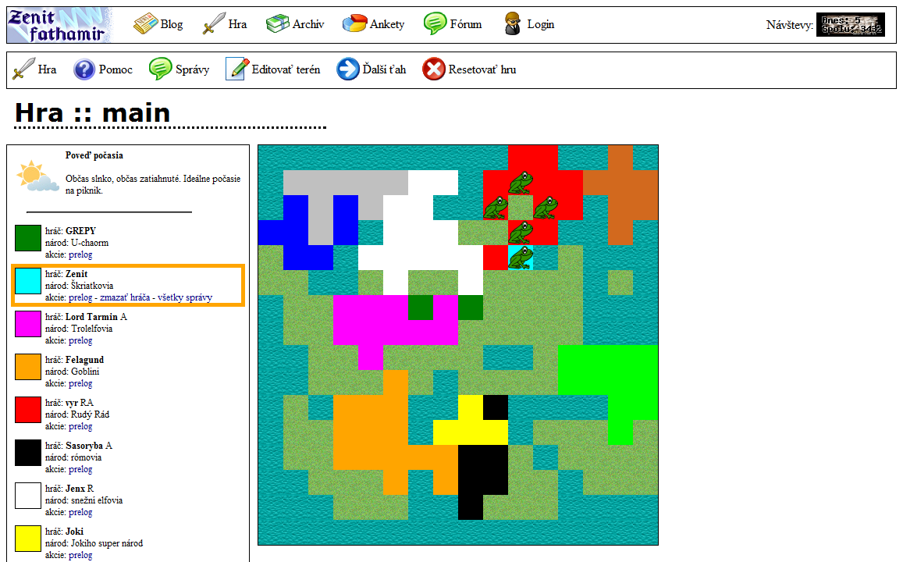
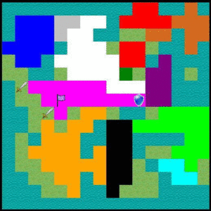

Eidžof
======

Eidžof is an online turn-based strategy game. It consists of only one source file `hra.php`. 

It is played in browser, one turn per day. A prototype and the only working instance of this game was playable from 20.9.2009 to 21.2.2010 on [zenit.fathamir.sk/hra](http://zenit.fathamir.sk/hra) (the site does not exist anymore)

Technology used: PHP, MySQL, HTML, CSS

Timelapse of several turns from the viewpoint of player *Lord Tarmin*:

